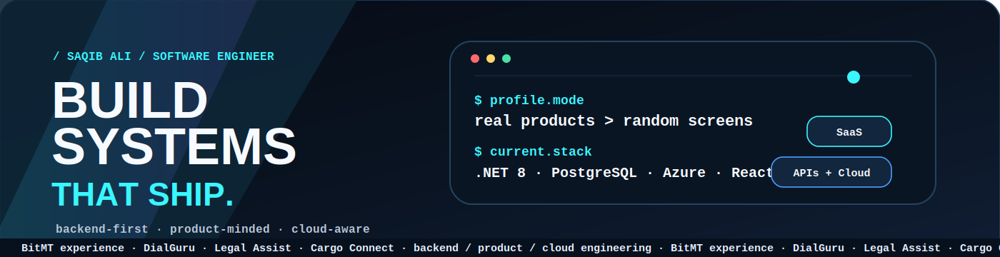
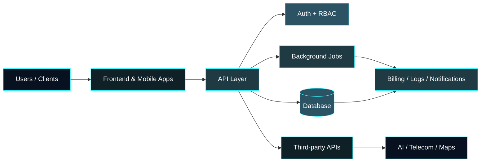
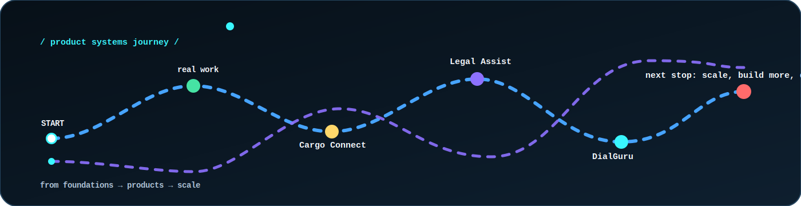

<div align="center">



<br/>
<br/>


<a href="https://github.com/Saqibali2"></a>
<a href="https://www.linkedin.com/in/builtbysaqib/"></a>
<a href="mailto:saqibali.0748@gmail.com"></a>


</div>

---


## `profile.scan()`

```txt
name              Saqib Ali
role              Software Engineer
experience        2.5+ years professional SaaS/backend experience
company_history   BitMT · USA-based company
focus             backend systems · SaaS platforms · AI apps · cloud deployment
main_stack         .NET 8 · PostgreSQL · Azure · React Native
current_build      DialGuru / VLCI Dialer
```

I build the parts users usually do not see but businesses depend on: **auth, APIs, data models, roles, billing flows, integrations, deployment, logs, and maintainability.**

---

## Activity signal

<div align="center">


<br/><br/>


</div>

```txt
activity summary:
  - active contributor building momentum in 2026
  - backend-focused repos dominate the work
  - visible GitHub activity supports the project story
```

> Activity is a signal. The stronger proof is shipped systems, readable repos, and product depth.

---

## Core stack

<div align="center">


</div>

```txt
Backend        .NET 8 · C# · REST APIs · EF Core
Database       PostgreSQL · SQL Server · relational modeling
Mobile/Web     React Native · React · TypeScript
Cloud          Azure App Service · Azure PostgreSQL · DigitalOcean
Workflow       Git · GitHub Actions · Swagger · Visual Studio 2022
Systems        SaaS · RBAC · billing flows · multi-tenancy · AI integrations
```

---

## Engineering map



---

## Professional experience

### Software Engineer — BitMT  
`Feb 2023 – Jul 2025 · USA-based company`

Backend maintenance and product support for a SaaS LMS used by schools, plus CMS-based client projects for service businesses.

```txt
handled:
  - backend module maintenance
  - SaaS LMS fixes and improvements
  - client-requested CMS changes
  - production issue debugging
  - occasional frontend/UI updates
  - delivery and support for real users
```

**Engineering baseline:** real clients · real systems · real bugs · real maintenance · real responsibility

---

## Product systems

<details open>
<summary><b>DialGuru / VLCI Dialer</b> — AI outbound call-center SaaS</summary>

<br/>

For Pakistani call centers serving US clients in solar, Medicare, and insurance.

```txt
stack       .NET 8 · PostgreSQL · Azure · Telnyx · Hangfire
type        multi-tenant SaaS
status      backend Phase 1 complete and deployed · Telnyx calling tested
focus       roles · billing · encrypted credentials · API-first backend
```

**What this proves:** SaaS thinking, backend architecture, billing logic, third-party integration, deployment discipline.

</details>

<details>
<summary><b>Legal Assist</b> — AI legal guidance app</summary>

<br/>

Plain-language legal help personalized by nationality and country of residence.

```txt
stack       React Native · .NET 8 · PostgreSQL · DigitalOcean · LLM
platform    Android app
focus       auth · role access · country-aware AI · tiered access system
```

**What this proves:** solo product ownership, AI integration, mobile/backend execution, deployment awareness.

</details>

<details>
<summary><b>Cargo Connect</b> — logistics and truck booking platform</summary>

<br/>

Final-year engineering project for automated truck booking and shipment management.

```txt
stack       React Native · .NET · SQL Server · Google Maps API
domain      logistics · shipment management
focus       live maps · booking · route polylines · billing flow
```

**What this proves:** maps integration, logistics workflow thinking, real-time product flow, booking-to-billing logic.

</details>

---

## Journey map

<div align="center">
  
</div>

> From foundations → products → scale.

---

## Engineering operating system

```txt
01  understand the business flow
02  convert the flow into a data model
03  design the API contract
04  build the backend first
05  test in Swagger
06  fix logic and calculation issues early
07  connect frontend after backend is stable
08  deploy
09  verify in production-like conditions
10  improve based on real behavior
```

---

## Decision style

```diff
- random screens
+ business-flow-driven features

- fake placeholder APIs
+ real endpoints tested in Swagger

- hardcoded provider keys
+ tenant/branch-based encrypted credentials

- UI-first confusion
+ backend contract first

- big rewrites without proof
+ small tested increments

- "it works locally"
+ deployed and verified behavior
```

---

## What I am targeting

```txt
primary roles:
  - .NET Backend Developer
  - Full Stack Developer
  - SaaS Backend Engineer
  - Software Engineer — Backend/API
  - AI Application Developer
  - Cloud / Azure Developer

best environments:
  - product companies
  - SaaS platforms
  - backend-heavy teams
  - startups that need build + debug + deploy speed
```

---

## Proof of work

```txt
professional experience  -> BitMT, USA-based company
backend proof            -> SaaS maintenance, APIs, production support
product proof            -> DialGuru, Legal Assist, Cargo Connect
deployment proof         -> Azure, DigitalOcean, GitHub Actions
engineering proof        -> auth, RBAC, billing flows, multi-tenancy, integrations
```

References and documents are available when needed, but I prefer my work to speak first.

---

<div align="center">

### Currently building

**DialGuru** — AI outbound call-center SaaS

### Long-term direction

Backend/product engineering · SaaS systems · AI applications · cloud-ready platforms

<br/>

<a href="mailto:saqibali.0748@gmail.com"></a>
<a href="https://www.linkedin.com/in/builtbysaqib/"></a>
<a href="https://github.com/Saqibali2"></a>

</div>
